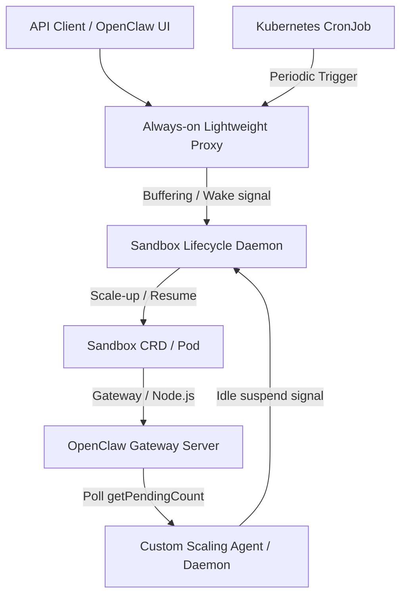

# OpenClaw and Agent Sandbox Integration Plan

This directory contains the joint architectural and implementation plan to integrate **Agent Sandbox** (a Kubernetes SIG Apps subproject for stateful, pod-backed agent runtimes) and **OpenClaw** (a TypeScript-based AI agent gateway).

## Objective
Maximize resource efficiency, support scale-to-zero/idleness, and automate lifecycle oversight (TTL, snapshots, wakeup time) for OpenClaw gateways running in Kubernetes-managed Sandboxes.

## Top Level Proposal
To seamlessly unite OpenClaw and Agent Sandbox, this proposal introduces several key, highly integrated architectural components and configurations:

1. **Sandbox Lifecycle Daemon (Instance Manager)**: A server-side supervisor that acts as a Kubernetes namespace controller. It enforces session TTLs, idle-time limits, and scheduled pre-warming (`spec.lifecycle.wakeupTime`). It manages GKE snapshots and coordinates clean transitions of Sandbox `operatingMode` between `Running` and `Suspended`.
2. **Lightweight Wakeup Proxy (Traffic Broker)**: An always-on ingress proxy that routes client HTTP/WS requests to OpenClaw. When a Sandbox is suspended (scaled to zero), the proxy buffers the connection, triggers a scale-up via the Lifecycle Daemon, polls the Sandbox `Ready: True` condition, and replays traffic once online.
3. **Automatic Checkpoint/Resume Workflow (CRIU & Warm Pools)**: Preserves live container process and memory state. It leverages GKE's native `PodSnapshotManualTrigger` (via gVisor CRIU) to capture memory checkpoints before suspension, and verifies complete process restoration by polling for the GKE-native `type="PodRestored"` with `status="True"` condition upon resume.
4. **PD Attach/Reattach (Volume Persistence)**: Defines standard volume claim templates (`volumeClaimTemplates`) in the `SandboxTemplate` to dynamically provision CSI persistent disks. Mounted at OpenClaw's config (`.clawdbot`) and workspace (`clawd`) directories, these volumes survive Pod scale-to-zero, ensuring zero data loss.
5. **`k8s-agent-sandbox-js` (JS/TS SDK)**: A hand-written, robust TypeScript SDK matching official Go/Python designs. It supports Direct, Gateway, and native SPDY PortForwarding connection strategies, enforces strict percent-encoding path and filename basenames, and features a transient-error HTTP retry engine with jittered backoff.
6. **OpenClaw Scale-to-Zero Alignment**: Configures OpenClaw for minimal container activity (disables built-in LLM heartbeats), keeps internal cron schedules but exposes next run-times to dynamically configure external pre-wakeup jobs, and exposes a `/v1/health/idle` status API reflecting pending queue sizes.

## Architecture Overview



## Key Integration Gaps & Solutions

### 1. Sandbox State Persistence (CRIU vs. Volume Claims)
* **Analysis**: There are multiple ways to handle statefulness during scale-to-zero (GKE Pod Snapshots vs. Stateful PVC reattachment). Choosing the right approach is critical for balancing cold-start latency and storage costs.
* **Detailed Comparison**: See [snapshot_techniques_comparison.md](snapshot_techniques_comparison.md)

### 2. Automatic Checkpoint/Resume Workflow (CRIU & Warm Pools)
* **Problem**: Scale-to-zero cold-start latency can degrade user experience, and background operations must be safely paused and resumed without losing in-memory state.
* **Solution**: Implement an automatic pod checkpoint/resume workflow using container checkpointing (CRIU) combined with Agent Sandbox's Warm Pools.
* **Detailed Plan**: See [checkpoint_restore_workflow.md](checkpoint_restore_workflow.md)

### 3. Server-Side Session Oversight (Instance Manager & TTL)
* **Problem**: Snapshot and lifecycle management are currently client-driven via the SDK. If a client crashes or disconnects, the sandbox leaks resources.
* **Solution**: Introduce a server-side **Sandbox Lifecycle Daemon** (Instance Manager) that enforces TTLs, automates state snapshots before shutdown, and manages idleness.
* **Detailed Plan**: See [sandbox_sidecar_daemon.md](sandbox_sidecar_daemon.md)

### 4. Wakeup-on-Traffic & Wakeup Time Feature
* **Problem**: Scale-to-zero WebSocket servers do not natively wake on incoming WebSocket/HTTP raw traffic in simple environments like kind.
* **Solution**: Deploy a lightweight **always-on HTTP proxy/broker** that buffers inbound connections, triggers a Sandbox scale-up (resume), and forwards traffic once the Sandbox is ready.
* **Detailed Plan**: See [sandbox_sidecar_daemon.md](sandbox_sidecar_daemon.md)

### 5. JavaScript/TypeScript SDK for Agent Sandbox
* **Problem**: OpenClaw is written in JS/TS, but Agent Sandbox only provides Go and Python SDKs.
* **Solution**: Design and build `k8s-agent-sandbox-js`—a hand-written, robust JS/TS SDK that implements connection tunneling, command execution, and lifecycle hooks.
* **Detailed Plan**: See [javascript_sdk.md](javascript_sdk.md)

### 6. Aligning OpenClaw Internal Mechanisms
* **Problem**: Default OpenClaw configurations (periodic heartbeats, internal cron jobs) prevent the container from reaching an idle state or fail when scaled to zero.
* **Solution**: Disable built-in agent heartbeats, query next cron run-times to configure external pre-wakeup GKE timers, and expose `getPendingCount()` to the auto-scaler.
* **Detailed Plan**: See [openclaw_idle_and_wake.md](openclaw_idle_and_wake.md)

### 7. MVP Implementation Roadmap
* **Problem**: Integrating all of these components needs a clear, sequential path to ensure stable GKE execution.
* **Solution**: A structured implementation plan covering lifecycle daemons, typescript hooks, checkpoint triggers, and end-to-end verification.
* **Detailed Plan**: See [mvp_implementation_plan.md](mvp_implementation_plan.md)

## Protocol Buffers (Protobuf) Specifications

To guarantee type-safe, contract-driven interfaces between the **Lightweight Proxy**, **Lifecycle Daemon**, and **OpenClaw custom scaling controllers**, we define the following Protobuf specifications (`agents.proto`):

```protobuf
syntax = "proto3";

package agents.integration.v1;

option go_package = "sigs.k8s.io/agent-sandbox/plan/protos/v1;v1";

// --------------------------------------------------------------------
// Sandbox Lifecycle Service (Exposed by Sandbox Lifecycle Daemon)
// --------------------------------------------------------------------
service LifecycleService {
  // Triggers the scale-down/suspension of a Sandbox, including active CRIU checkpointing
  rpc SuspendSandbox(SuspendSandboxRequest) returns (SuspendSandboxResponse);

  // Resumes a Sandbox, restoring process state from a warm pool snapshot
  rpc ResumeSandbox(ResumeSandboxRequest) returns (ResumeSandboxResponse);

  // Queries the current status, state, and conditions of a Sandbox
  rpc GetSandboxStatus(GetSandboxStatusRequest) returns (GetSandboxStatusResponse);
}

enum OperatingMode {
  OPERATING_MODE_UNSPECIFIED = 0;
  OPERATING_MODE_RUNNING = 1;
  OPERATING_MODE_SUSPENDED = 2;
}

enum SandboxState {
  SANDBOX_STATE_UNSPECIFIED = 0;
  SANDBOX_STATE_PROVISIONING = 1;
  SANDBOX_STATE_RUNNING = 2;
  SANDBOX_STATE_SUSPENDING = 3;
  SANDBOX_STATE_SUSPENDED = 4;
  SANDBOX_STATE_RESUMING = 5;
}

message SuspendSandboxRequest {
  string name = 1;
  string namespace = 2;
  bool force_snapshot = 3;
  int64 grace_period_seconds = 4;
}

message SuspendSandboxResponse {
  bool success = 1;
  string snapshot_uid = 2;
  string error_message = 3;
}

message ResumeSandboxRequest {
  string name = 1;
  string namespace = 2;
  string snapshot_uid = 3;
  bool pre_warm_only = 4;
}

message ResumeSandboxResponse {
  bool success = 1;
  string pod_ip = 2;
  string error_message = 3;
}

message GetSandboxStatusRequest {
  string name = 1;
  string namespace = 2;
}

message Condition {
  string type = 1;
  string status = 2;
  string reason = 3;
  string message = 4;
  int64 last_transition_time_epoch_ms = 5;
}

message GetSandboxStatusResponse {
  string name = 1;
  SandboxState state = 2;
  OperatingMode desired_mode = 3;
  repeated Condition conditions = 4;
}

// --------------------------------------------------------------------
// Ingress Proxy Service (Exposed by Ingress/Traffic Broker)
// --------------------------------------------------------------------
service ProxyService {
  // Registers a dynamic routing endpoint for an active sandbox
  rpc RegisterRoute(RegisterRouteRequest) returns (RegisterRouteResponse);

  // Evicts a route when a sandbox scales down
  rpc EvictRoute(EvictRouteRequest) returns (EvictRouteResponse);
}

message RegisterRouteRequest {
  string sandbox_name = 1;
  string namespace = 2;
  string target_ip = 3;
  int32 target_port = 4;
}

message RegisterRouteResponse {
  bool registered = 1;
}

message EvictRouteRequest {
  string sandbox_name = 1;
  string namespace = 2;
}

message EvictRouteResponse {
  bool evicted = 1;
}

// --------------------------------------------------------------------
// OpenClaw Idle State Service (Exposed by OpenClaw Container/Scaling Agent)
// --------------------------------------------------------------------
service ScaleService {
  // Queries details on active queues, embedded runs, and idle status
  rpc GetIdleMetrics(GetIdleMetricsRequest) returns (GetIdleMetricsResponse);
}

message GetIdleMetricsRequest {
  string sandbox_name = 1;
}

message GetIdleMetricsResponse {
  bool is_idle = 1;
  int32 queue_size = 2;
  int32 pending_replies = 3;
  int32 active_embedded_runs = 4;
  int32 active_tasks = 5;
}
```

