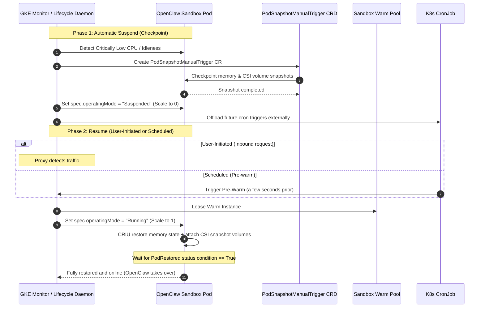
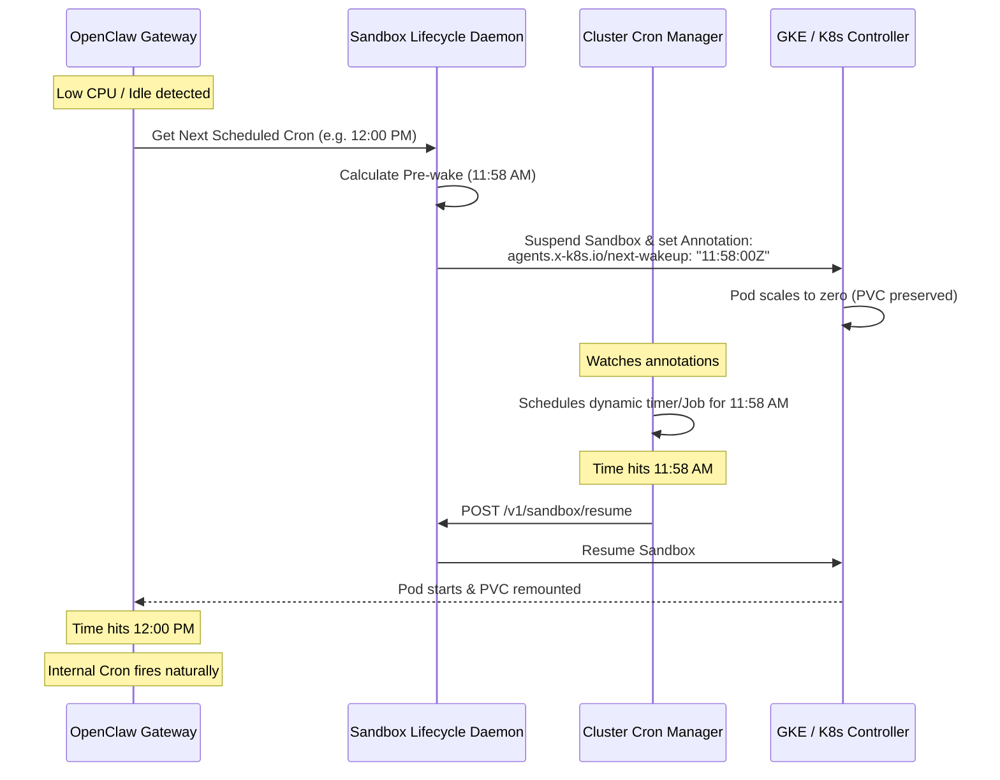

# Pod Checkpoint/Restore Workflow (CRIU & Warm Pools)

To maximize performance and eliminate startup latency during scale-to-zero operations, we use GKE's native **Container Checkpoint/Restore** mechanism (CRIU) combined with the **Sandbox Warm Pool** controller. This ensures that when a Sandbox is suspended, its active process state, memory, and disk volumes are saved and restored intact upon resume.

This design is fully aligned with the GKE Snapshot patterns implemented in the Python SDK (`k8s_agent_sandbox.gke_extensions.snapshots`).

> [!NOTE]
> **MVP Simplification**: For the initial MVP, we are using **Persistent Volume Claims (PVC) only** to pause and resume states instead of CRIU memory checkpointing. The Sandbox Pod is scaled to zero when suspended, preserving all workspace files, configurations, and conversation database history on the persistent volume. When resumed, a new Pod is created and the same volume is mounted back.

---

## Workflow Architecture



---

## 1. Triggering & Checkpoint
When GKE or the Custom Lifecycle Daemon detects critically low CPU utilization of the OpenClaw pod sandbox (indicating idleness):
- **Metric Monitoring**: Polling system-level CPU usage alongside OpenClaw's internal `/v1/health/idle` endpoint.
- **Pod Snapshot Creation**: The Lifecycle Daemon creates a new `PodSnapshotManualTrigger` Custom Resource targeting the Sandbox Pod. 
  - This triggers GKE to perform an active container checkpoint (CRIU) to capture the process tree, variables, and socket states.
  - Concurrently, CSI persistent volume snapshots are taken to capture the `.clawdbot` configuration and workspace storage (`clawd`).
- **Suspension**: Once the snapshot is complete, the Lifecycle Daemon sets `spec.operatingMode = "Suspended"` on the Sandbox CR. The controller terminates the active Pod while retaining its metadata.
- **Cron Offloading**: Future scheduled tasks are offloaded to external Kubernetes CronJobs.

---

## 2. User-Initiated Resume
When a new end-user request arrives (detected by the Lightweight Traffic Proxy):
- **Warm Pool Lease**: The Lifecycle Daemon immediately leases a pre-warmed, suspended container instance from the `SandboxWarmPool`.
- **Pod Scale-Up**: The Lifecycle Daemon sets `spec.operatingMode = "Running"` on the Sandbox CR.
- **Memory & Volume Restore**:
  - The GKE controller schedules a restored Pod using the latest snapshot.
  - The backing CSI volume snapshots are mounted.
  - CRIU restores the in-memory execution state of the Node.js process in milliseconds.
- **Restoration Verification**: The Lifecycle Daemon polls the Pod status conditions:
  - It validates that `type="PodRestored"` has status `status="True"`.
  - It checks that the pod was successfully restored from the correct snapshot UID.
- **Zero Cold-Start Latency**: The OpenClaw process resumes execution exactly where it left off, instantly processing the buffered connection without Node.js boot-up, compilation, or database re-connection phases.

---

## 3. Scheduled Resume (Dynamic Pre-Wakeup Cron Trigger)

For workloads like OpenClaw that configure and manage their own internal cron schedulers, suspending the container would normally prevent the internal cron from firing because the container is shut down.

To preserve the internal cron triggers without running the container 24/7 or duplicating the cron configurations in Kubernetes, we implement a **Dynamic Pre-Wakeup Cron Trigger** mechanism:

### Workflow Sequence



### Operational Steps
1. **Cron Inspection**:
   - Right before suspending, the Sandbox Lifecycle Daemon queries OpenClaw's internal state (e.g., via an endpoint `/api/v1/cron/next`) to read the next scheduled task execution time (e.g. `12:00:00Z`).
2. **Pre-Wake Calculation**:
   - The daemon calculates a wakeup time exactly **2 minutes prior** to the scheduled run (e.g., `11:58:00Z`).
3. **Annotation Binding**:
   - The Lifecycle Daemon updates the `Sandbox` metadata by setting the `agents.x-k8s.io/next-wakeup` annotation:
     ```yaml
     metadata:
       annotations:
         agents.x-k8s.io/next-wakeup: "2026-06-06T11:58:00Z"
     ```
   - The sandbox is then patched to `spec.operatingMode: "Suspended"`, terminating the Pod.
4. **Dynamic Triggering**:
   - A cluster-wide controller (the **Cluster Cron Manager**) watches all Sandbox resources for the `next-wakeup` annotation.
   - It dynamically schedules a lightweight Kubernetes Job or updates a cluster timer to fire at `11:58:00Z`.
5. **Early Resume & Execution**:
   - When the timer triggers, it calls `/v1/sandbox/resume` to scale the Sandbox back to `Running`.
   - The Pod starts up and mounts the workspace PVC.
   - When the clock hits `12:00:00Z`, OpenClaw's internal cron fires naturally. When the execution completes and the sandbox becomes idle, it scales back to zero.
