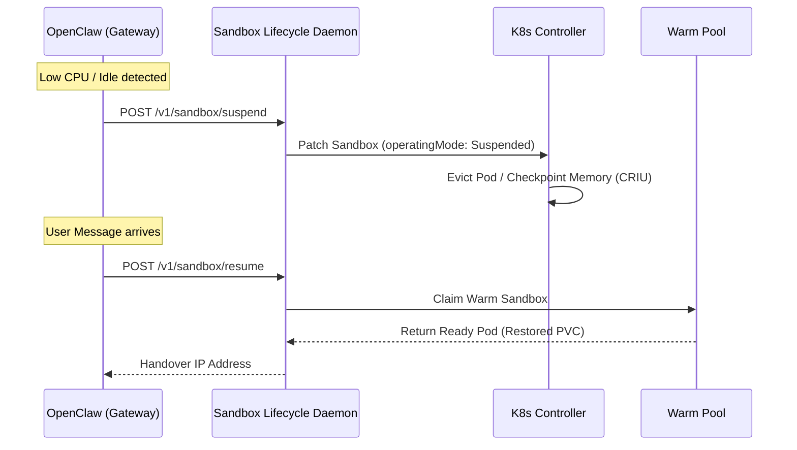

# MVP Implementation Plan: Automatic Pod Checkpoint & Resume

This document outlines the step-by-step integration workflow to deliver the MVP for the automatic checkpoint, idle-suspension, and warm-pool resume process using **agent-sandbox** and **OpenClaw**.

---

## 🛠️ Architecture Overview

## 🔒 Connection Strategy (In-Cluster Direct Routing)

For this MVP, we are implementing **Scenario A (In-Cluster Routing)**:
- OpenClaw and the Sandbox workloads run in the same Kubernetes cluster.
- OpenClaw uses the built-in **SSH backend** (`backend: "ssh"`) to connect to Sandbox execution targets.
- Upon successful claim resolution, OpenClaw extracts the sandbox's cluster-internal Pod IP (`status.sandbox.podIPs[0]`) and connects to it directly over SSH (port `22`).
- This eliminates the need for external DNS records or routing tunnels in the production environment.

---

## 📅 Implementation Phases

### Phase 1: Sandbox Lifecycle Daemon (Go/gRPC & HTTP Gateway)
Implement a lightweight lifecycle sidecar/daemon that runs alongside the controller manager or within the sandbox network, exposing the lifecycle control interface.
- **Tasks**:
  1. Define the gRPC protocol buffers for `LifecycleService` (suspend, resume, status) in a `.proto` file.
  2. Implement the gRPC/HTTP proxy in Go/Python that maps HTTP endpoints (`/v1/sandbox/suspend`, `/v1/sandbox/resume`) to client-go API patches:
     - **Suspend**: Patches `spec.operatingMode: Suspended` on the target Sandbox.
     - **Resume**: Adopts an instance from the `SandboxWarmPool` via `SandboxClaim`.
- **Target Files**: 
  - Create `internal/lifecycle/daemon/main.go`
  - Create `internal/lifecycle/daemon/server.go`

---

### Phase 2: OpenClaw Idle and Wake Hook (TypeScript)
Modify OpenClaw to detect inactivity and request sandbox suspension, and to trigger a resume when a user query arrives.
- **Tasks**:
  1. Add an idle timer inside the gateway server (`openclaw/src/gateway/server.impl.ts`) that tracks active agent runs. If the gateway remains idle for `X` minutes, trigger a background HTTP call to the Lifecycle Daemon's `/suspend` endpoint.
  2. Modify the inbound HTTP chat router (`openclaw/src/gateway/server-http.ts`) to intercept client requests:
     - If the sandbox is currently suspended, call the `/resume` endpoint first.
     - Wait for the new pod IP to become ready before routing the traffic.
- **Target Files**:
  - Edit [openclaw/src/gateway/server.impl.ts](file:///usr/local/google/home/glottman/dev/agent-sandbox-openclawevents/openclaw/src/gateway/server.impl.ts)
  - Edit [openclaw/src/gateway/server-http.ts](file:///usr/local/google/home/glottman/dev/agent-sandbox-openclawevents/openclaw/src/gateway/server-http.ts)

### Phase 3: Persistent Volume (PVC) Pause & Resume Configuration
Configure Persistent Volume Claims (PVC) to preserve the workspace files and session database across pod scale-to-zero suspension cycles.
- **Tasks**:
  1. Define the `volumeClaimTemplates` inside the `SandboxTemplate` manifest to map the workspace mount point (`/home/node/.openclaw/workspace`).
  2. Confirm that suspending the Sandbox deletes the Pod container but leaves the PVC untouched.
  3. Verify that waking the Sandbox maps the same volume back with files preserved.
- **Target Files**:
  - Edit [examples/openclaw-sandbox/openclaw-template-claim.yaml](file:///usr/local/google/home/glottman/dev/agent-sandbox-openclawevents/examples/openclaw-sandbox/openclaw-template-claim.yaml)

---

### Phase 4: End-to-End Verification & Testing
Verify the complete lifecycle:
- **Steps**:
  1. Send a request to the claw agent to initiate a task.
  2. Let the task idle; verify that `kubectl get sandbox` transitions status to `Suspended` and the pod is evicted.
  3. Send a new chat message to `http://localhost:18789/chat`; verify that the claim controller adopts a warm pool sandbox, restores memory, and continues execution seamlessly.
